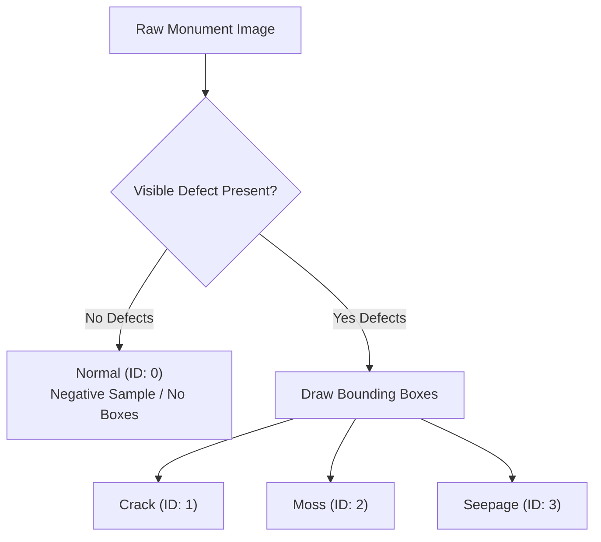

# Heritage Monument Decay Annotation Guidelines

**Project:** AI-Based Decay Monitoring and Preservation Recommendation System for Ancient Monuments  
**Reference:** Senmozhi Project Proposal — Work II  
**Document Version:** 1.0 (Phase 2)

---

## 1. Scope & Purpose

This document provides rigorous visual and operational criteria for annotating physical deterioration on ancient Indian monuments and stone heritage structures.

> **MANDATE:**  
> **SSD training cannot begin until human-verified bounding-box annotations are available and validated.**  
> Synthetic bounding boxes, pseudo-labels, and full-image pseudo-annotations are strictly prohibited.

---

## 2. Dataset Isolation & Duplicate Handling

- **Source Dataset:** `c:\Users\subaj\OneDrive\Desktop\intern\TEMPLE` (325 raw JPEG images).
- **Canonical Dataset:** 307 unique images cataloged in [`ai/dataset/annotation_manifest.csv`](file:///c:/Users/subaj/OneDrive/Desktop/intern/heritage-ai-decay-monitoring/ai/dataset/annotation_manifest.csv).
- **Excluded Duplicates:** 18 exact byte-for-byte duplicate images cataloged in [`ai/dataset/duplicates_manifest.csv`](file:///c:/Users/subaj/OneDrive/Desktop/intern/heritage-ai-decay-monitoring/ai/dataset/duplicates_manifest.csv).
- **Leakage Prevention:** Duplicate files MUST NOT be annotated or included in the dataset to avoid cross-split data leakage between training and evaluation partitions.

---

## 3. Four Project Classes & Annotation Rules



### Class 0: Normal
- **Definition:** Undamaged or healthy monument surface, intact stone masonry, historic carving details without active structural or biological degradation.
- **Annotation Rule:** **DO NOT DRAW BOUNDING BOXES.**
  - An intact image contains **0 bounding boxes**.
  - Drawing an artificial bounding box covering the entire image $[0, 0, W, H]$ degrades SSD anchor matching and produces false positive priors during multi-scale feature extraction.
  - In Pascal VOC XML, save the file with zero `<object>` elements, or register the file as `is_normal: true` in the dataset manifest.

### Class 1: Crack
- **Definition:** Structural fractures, fissures, surface micro-cracking, joint separation, or split masonry blocks.
- **Visual Features:** Linear, dark, irregular crevices cutting across stone blocks or running along mortar joints.
- **Annotation Rule:**
  - Enclose the crack within a tight bounding box.
  - For long meandering or branching cracks, break the crack into 2 or 3 tighter boxes rather than one giant bounding box that captures 90% healthy background.
  - Do not confuse intentional decorative grooves or architectural moldings with structural cracks.

### Class 2: Moss
- **Definition:** Biological growth, algae colonies, bryophyte patches, lichen crusts, or invasive weed roots.
- **Visual Features:** Dark green, brownish-green, or grey crusty colonies adhering to porous stone, cornices, or damp basement plinths.
- **Annotation Rule:**
  - Draw bounding boxes tightly enclosing each localized colony.
  - If a large wall section is uniformly blanketed by moss, enclose the continuous patch.

### Class 3: Seepage
- **Definition:** Active or historic moisture infiltration, damp staining, capillary water rise, and efflorescence (white mineral salt deposits).
- **Visual Features:** Dark damp patches, tide marks on lower masonry tiers, and white/yellowish crystalline salt deposits left behind after moisture evaporation.
- **Annotation Rule:**
  - Enclose the damp stain boundary and efflorescence zone tightly.
  - If water seepage has caused both damp staining and moss growth, create two overlapping or adjacent bounding boxes: one for `Seepage` and one for `Moss`.

---

## 4. Multi-Label & Co-occurrence Rules

Ancient monuments in tropical climates frequently exhibit multiple decay modes simultaneously:
- **Rule:** When multiple distinct defects appear in a single frame, annotators must create separate bounding boxes for each defect instance.
- **Example:**
  ```text
  Image: IMG_20260609_073544.jpg
   ├── Box 1: Crack   [xmin: 450, ymin: 1200, xmax: 980, ymax: 1850]
   ├── Box 2: Moss    [xmin: 320, ymin: 1750, xmax: 1400, ymax: 2900]
   └── Box 3: Seepage [xmin: 1100, ymin: 2500, xmax: 2100, ymax: 3800]
  ```

---

## 5. Ambiguity & Quality Assurance

- If a feature is ambiguous (e.g. shadow cast by a gopuram pillar resembling a crack, weathered texture resembling seepage), do NOT guess.
- Annotators must log ambiguous images in `ai/annotations/flagged_for_review.csv` with the image name, region coordinates, and a brief description.
- A senior conservationist or team lead will review flagged images before finalizing the dataset.

---

## 6. Future Train / Validation / Test Split Strategy

Once all 307 unique images are annotated and validated with `scripts/validate_annotations.py`:
1. **Target Ratios:**
   - **Training (70%):** ~215 unique images
   - **Validation (20%):** ~61 unique images
   - **Test (10%):** ~31 unique images
2. **Stratification Constraints:**
   - Balanced representation of each defect class (`Crack`, `Moss`, `Seepage`, and clean `Normal`).
   - Balanced distribution across the 6 temple sites (preventing the model from overfitting to specific temple stone types).
   - Strict leakage prevention: Zero duplicate or near-duplicate images across splits.
